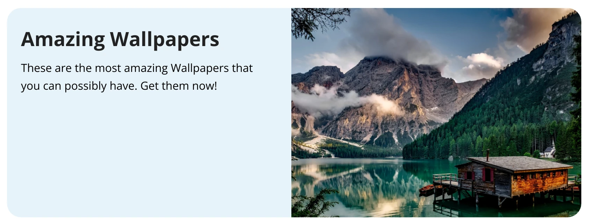
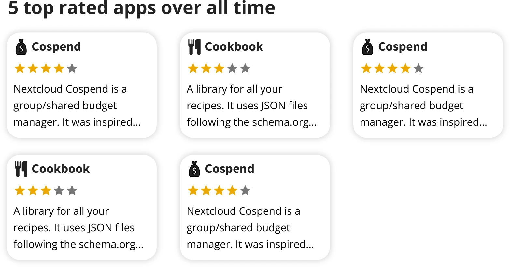
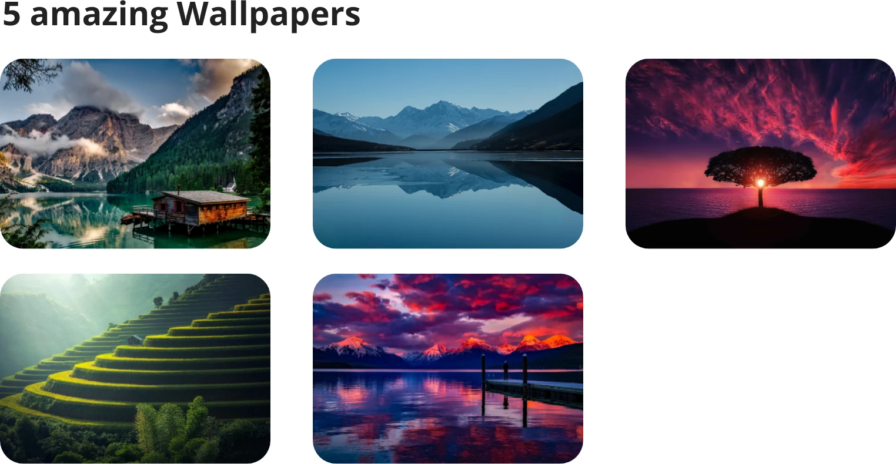
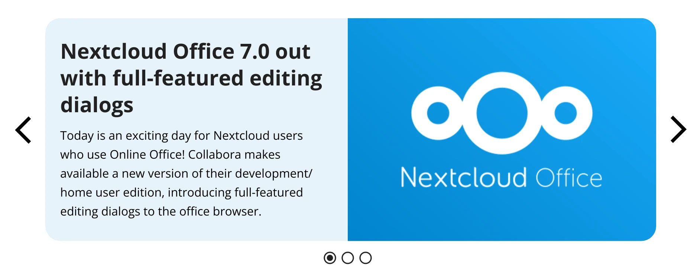
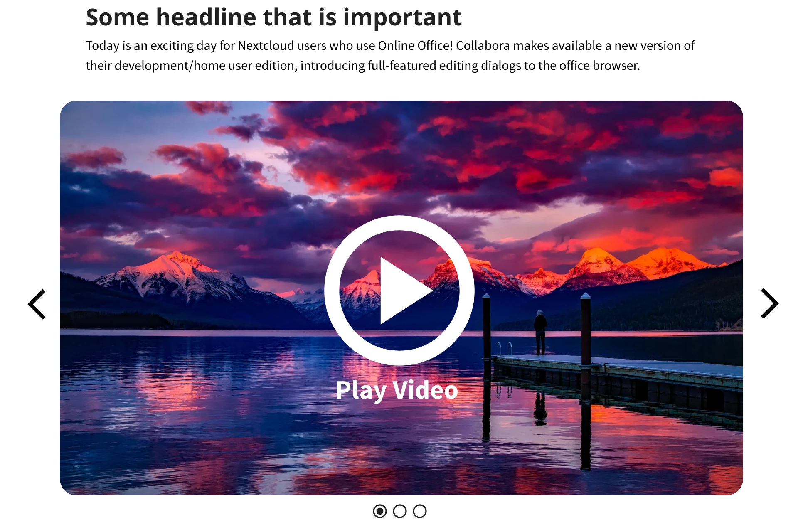
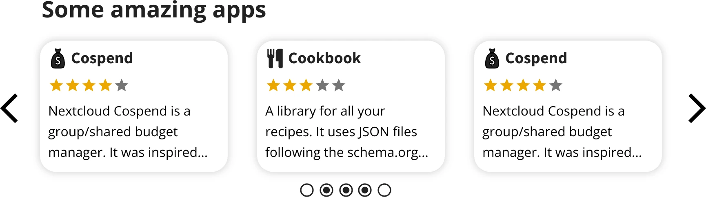

.. _app-discover:

Appstore discover section API
=============================

The appstore "Discover" section is generated from data is provided using a JSON file.
The ``discover.json`` consists of an array containing multiple elements, those elements are either shuffled or can be always shown.

Currently the following elements are supported:

Posts
	Posts consists of a headline, a text and an optional image.
Full width media
	Like images (webp is recommended due to quality, size and browser support), animations (webm or mp4) or videos [#foot-videos]_
App showcases
	Promote a set of apps
Carousel
	Allow to shuffle through multiple elements

.. [#foot-videos] For videos see the example below.

Supported elements
------------------

.. contents::
	:local:

Common element interface
^^^^^^^^^^^^^^^^^^^^^^^^

All content types are sharing a common interface

.. code-block:: json

	{
		// The type of the element
		"type": "post",
		// ID to indentify this element
		"id": "1d41a08e-4aa6-49b3-ad1b-ff2e83bcdc88",
		// (optional) if set this element will be always shown on that specified position
		"order": 1,
		// (optional) if set the content will only be shown starting that date
		"date": "2024-04-04T20:00:00Z",
		// (optional) if set the content will only be shown UNTIL that date
		"expiryDate": "2024-05-04T20:00:00Z",
		// (optional) the optionally localized headline, if a language is missing the "en" default is used
		"headline": {
			"en": "...",
			"de": "..."
		},
		// (optional) link for the element
		"link": "https://..."
	}

Simple post: ``type: "post"``
^^^^^^^^^^^^^^^^^^^^^^^^^^^^^

Post are elements with a headline, a text and an (optional) media part.
All elements of it can be localized.

Example 1: Post with image
""""""""""""""""""""""""""

.. code-block:: json

	{
		"type": "post",
		"id": "1d41a08e-4aa6-49b3-ad1b-ff2e83bcdc88",
		"headline": {
			"en": "Amazing wallpapers",
			"de": "Bezaubernde Hintergründe"
		},
		"text": {
			"en": "This are the most amazing wallpaers that you can possible have. Get them now!",
			"de": "Die wohl beeindruckensten Hintergründe die man haben kann. Hol sie dir jetzt!"
		},
		"link": "https://example.com/wallpapers",
		"media": {
			"alignment": "end",
			"content": {
				"en": {
					"src": {
						"src": "http://example.com/a.png",
						"mime": "image/png"
					},
					"alt": "Amazing wallpaper"
				}
			}
		}
	}

Example 2: Post with video
""""""""""""""""""""""""""

.. code-block:: json

	{
		"type": "post",
		"id": "1d41a08e-4aa6-49b3-ad1b-ff2e83bcdc88",
		"media": {
			"content": {
				"en": {
					"src": {
						"src": "https://example.com/preview.webp", // the preview image (or animation)
						"mime": "image/webp"
					},
					"alt": "Some alternative text",
					"link": "http://example.com/full-video" // the link to navigate to when pressing "Play video"
				}
			}
		}
	}

Example 3: Post with localized media
""""""""""""""""""""""""""""""""""""

It is possible to have localized media, e.g. screenshots in different languages.
For this use an array for ``media`` instead:

.. code-block:: json

	{
		"type": "post",
		// ...
		"media": {
			"content": {
				"en": {
					"src": {
						"src": "https://example.com/english.webp",
						"mime": "image/webp"
					},
					"alt": "Some alternative text"
				}
				"de": {
					"src": {
						"src": "https://example.com/german.webp",
						"mime": "image/webp"
					},
					"alt": "Ein Alternativtext"
				}
			}
		}
	}

Showcase: ``type: "showcase"``
^^^^^^^^^^^^^^^^^^^^^^^^^^^^^^

The showcase type allow to promot multiple entries in one element. It allows to either show multiple posts or apps.

Example: Showcase with headline and apps
""""""""""""""""""""""""""""""""""""""""

.. code-block:: json

	{
		"type": "showcase",
		// ...
		"headline": {
			"en": "5 top rated apps over all time"
		},
		"content": [
			{
				"type": "app",
				"appId": "cospend"
			},
			{
				"type": "app",
				"appId": "cookbook"
			}
		]
	}

Example: Showcase with headline and media entries
"""""""""""""""""""""""""""""""""""""""""""""""""

.. code-block:: json

	{
		"type": "showcase",
		"headline": {
			"en": "5 amazing wallpapers"
		},
		"content": [
			{
				"type": "post",
				"media": {
					"content": {
						"en": {
							"src": {
								"src": "http://example.com/first.png",
								"mime": "image/png"
							},
							"alt": "Wallpaper..."
						}
					}
				}
			},
			{
				"type": "post",
				"media": {
					"content": {
						"en": {
							"src": {
								"src": "http://example.com/second.png",
								"mime": "image/png"
							},
							"alt": "Another wallpaper..."
						}
					}
				}
			}
			// other posts
		]
	}

Carousels: ``type: "carousel"``
^^^^^^^^^^^^^^^^^^^^^^^^^^^^^^^

Carousels allow the same common properties, like headlines and text, but have a ``content`` property for and array of posts to show.
The ``content`` property also allows the ``app`` type like ``type: "showcase"`` does.

Example: Carousel with post content
"""""""""""""""""""""""""""""""""""

.. code-block:: json

	{
		"type": "carousel",
		"content": [
			{
				"type": "post",
				"headline": {
					"en": "Nextcloud Office 7.0 out with full-featured editing dialogs"
				},
				"text": {
					"en": "Today is an..."
				},
				"media": {
					"content": {
						"en": {
							"src": {
								"src": "http://example.com/first.png",
								"mime": "image/png"
							},
							"alt": "..."
						}
					}
				}
			},
			// other posts
		]
	}

Example: Carousel with headline and media content
"""""""""""""""""""""""""""""""""""""""""""""""""

.. code-block:: json

	{
		"type": "carousel",
		"headline": {
			"en": "Some headline that is important"
		},
		"text": {
			"en": "Today is an..."
		},
		"content": [
			{
				"type": "post",
				"media": {
					"content": {
						"en": {
							"src": {
								"src": "http://example.com/first.png",
								"mime": "image/png"
							},
							"alt": "...",
							"link": "..."
						}
					}
				}
			},
			// other posts
		]
	}

Example: Carousel with app content
""""""""""""""""""""""""""""""""""

.. code-block:: json

	{
		"type": "carousel",
		"headline": {
			"en": "Some amazing apps"
		},
		"content": [
			{
				"type": "app",
				"appId": "Cospend",
			},
			// other apps
		]
	}

JSON data schema
----------------

The JSON can be validated using out schema, see :download:`app-discover.schema.json <./app-discover.schema.json>`.

.. contents::
	:local:

.. _app-discover-generic-element:

The generic element
^^^^^^^^^^^^^^^^^^^

This element all other inherit from

+----------------+---------------------------------------+-------------+-------------------------------------------------------------------------------------------------+
|       Property | Type                                  | Is required | Notes                                                                                           |
+----------------+---------------------------------------+-------------+-------------------------------------------------------------------------------------------------+
|       ``type`` | string                                |  yes        |                                                                                                 |
+----------------+---------------------------------------+-------------+-------------------------------------------------------------------------------------------------+
|         ``id`` | string                                |  yes        |                                                                                                 |
+----------------+---------------------------------------+-------------+-------------------------------------------------------------------------------------------------+
|      ``order`` | integer                               |             | For manual ordering. Elements without ``order`` are shuffled                                    |
+----------------+---------------------------------------+-------------+-------------------------------------------------------------------------------------------------+
|   ``headline`` | :ref:`app-discover-localized-strings` |             |                                                                                                 |
+----------------+---------------------------------------+-------------+-------------------------------------------------------------------------------------------------+
|       ``text`` | :ref:`app-discover-localized-strings` |             |                                                                                                 |
+----------------+---------------------------------------+-------------+-------------------------------------------------------------------------------------------------+
|       ``link`` | URL                                   |             | allows also ``app://APP_ID`` links opening the app, if installed or the appstore page otherwise |
+----------------+---------------------------------------+-------------+-------------------------------------------------------------------------------------------------+
|       ``date`` | string (ISO8601 date-time)            |             | Can be set to only show this entry after the specified date                                     |
+----------------+---------------------------------------+-------------+-------------------------------------------------------------------------------------------------+
| ``expiryDate`` | string (ISO8601 date-time)            |             | Can be set to only show this entry until the specified date                                     |
+----------------+---------------------------------------+-------------+-------------------------------------------------------------------------------------------------+

.. literalinclude:: ./app-discover.schema.json
   :language: json
   :linenos:
   :lines: 93-130

.. _app-discover-localized-strings:

Localized strings
^^^^^^^^^^^^^^^^^

Localized strings are objects with the language code as the key and the translated string as the property, like:

.. code-block:: json

	{ "en": "Hello", "de": "Hallo" }

+---------------+------------------+-------------+-------------------------------------------------------------------------------------------------+
|     Property  | Type             | Is required | Notes                                                                                           |
+---------------+------------------+-------------+-------------------------------------------------------------------------------------------------+
|       ``en``  | string           |  yes        | The English text                                                                                |
+---------------+------------------+-------------+-------------------------------------------------------------------------------------------------+
| language code | string           |             | The translated text for that language                                                           |
+---------------+------------------+-------------+-------------------------------------------------------------------------------------------------+

.. literalinclude:: ./app-discover.schema.json
   :language: json
   :linenos:
   :lines: 17-29

.. _app-discover-media-object:

Media object
^^^^^^^^^^^^

Media objects are used within the post element, they allow to embed video or image media.

+---------------+-----------------------------------+-------------+-------------------------------------------------------------------------------------------------+
|     Property  | Type                              | Is required | Notes                                                                                           |
+---------------+-----------------------------------+-------------+-------------------------------------------------------------------------------------------------+
|   ``content`` | :ref:`app-discover-media-content` |  yes        | The content to show                                                                             |
+---------------+-----------------------------------+-------------+-------------------------------------------------------------------------------------------------+
| ``alignment`` | string                            |             | When combined with text this defined the media alignment. One of: ``left``, ``right``, ``top``  |
+---------------+-----------------------------------+-------------+-------------------------------------------------------------------------------------------------+

.. literalinclude:: ./app-discover.schema.json
   :language: json
   :linenos:
   :lines: 78-91

.. _app-discover-media-content:

Media content
"""""""""""""

The media content is dictionary similar to :ref:`app-discover-localized-strings` but instead of strings its values are media content objects with following properties:

+---------------+-------------------------------------------------+-------------+------------------------------------------------------------------------------------+
|     Property  | Type                                            | Is required | Notes                                                                              |
+---------------+-------------------------------------------------+-------------+------------------------------------------------------------------------------------+
|       ``src`` | :ref:`app-discover-media-source` or array of it |  yes        | The media source, use an array for fallback options (source sets)                  |
+---------------+-------------------------------------------------+-------------+------------------------------------------------------------------------------------+
|       ``alt`` | string                                          |  yes        | The alternative text for the media                                                 |
+---------------+-------------------------------------------------+-------------+------------------------------------------------------------------------------------+
|      ``link`` | URL                                             |             | In case of videos this is the link to navigate when pressing the play-video button |
+---------------+-------------------------------------------------+-------------+------------------------------------------------------------------------------------+

.. literalinclude:: ./app-discover.schema.json
   :language: json
   :linenos:
   :lines: 43-62

.. _app-discover-media-source:

Media source
""""""""""""

+---------------+---------+-------------+------------------------------------------------------------------------------------+
|     Property  | Type    | Is required | Notes                                                                              |
+---------------+---------+-------------+------------------------------------------------------------------------------------+
|       ``src`` | URL     |  yes        | The URL of the media element                                                       |
+---------------+---------+-------------+------------------------------------------------------------------------------------+
|      ``mime`` | string  |  yes        | The MIME type of the media element                                                 |
+---------------+---------+-------------+------------------------------------------------------------------------------------+

.. literalinclude:: ./app-discover.schema.json
   :language: json
   :linenos:
   :lines: 31-41

.. _app-discover-app-element:

The app-element
^^^^^^^^^^^^^^^

The app element is only used in ``showcase`` elements.

+---------------+------------------+-------------+-------------------------------------------------------------------------------------------------+
|     Property  | Type             | Is required | Notes                                                                                           |
+---------------+------------------+-------------+-------------------------------------------------------------------------------------------------+
|      ``type`` | string           | yes         | ``"type": "app"``                                                                               |
+---------------+------------------+-------------+-------------------------------------------------------------------------------------------------+
|     ``appId`` | string           | yes         | The app id, e.g. ``text`` or ``forms``                                                          |
+---------------+------------------+-------------+-------------------------------------------------------------------------------------------------+

.. literalinclude:: ./app-discover.schema.json
   :language: json
   :linenos:
   :lines: 132-142

.. _app-discover-post-element:

The post-element
^^^^^^^^^^^^^^^^

The post element is the basic element for media or text entries, it inherits from the :ref:`app-discover-generic-element` and extends it by allowing the ``media`` property:

+---------------+-------------------------------------------+-------------+-------------------------------------------------------------------------------------------------+
|     Property  | Type                                      | Is required | Notes                                                                                           |
+---------------+-------------------------------------------+-------------+-------------------------------------------------------------------------------------------------+
|      ``type`` | string                                    | yes         | ``"type": "post"``                                                                              |
+---------------+-------------------------------------------+-------------+-------------------------------------------------------------------------------------------------+
|     ``media`` | :ref:`app-discover-media-object` or array | yes         | Either one :ref:`app-discover-media-object` or an array of multiple for localized media         |
+---------------+-------------------------------------------+-------------+-------------------------------------------------------------------------------------------------+

.. literalinclude:: ./app-discover.schema.json
   :language: json
   :linenos:
   :lines: 143-150

The showcase-element
^^^^^^^^^^^^^^^^^^^^

The showcase elements allows to display multiple posts inside one element, it inherits from the :ref:`app-discover-generic-element` and extends it by allowing the ``content`` property:

+---------------+-------------------------------------------+-------------+-------------------------------------------------------------------------------------------------+
|     Property  | Type                                      | Is required | Notes                                                                                           |
+---------------+-------------------------------------------+-------------+-------------------------------------------------------------------------------------------------+
|      ``type`` | string                                    | yes         | ``"type": "showcase"``                                                                          |
+---------------+-------------------------------------------+-------------+-------------------------------------------------------------------------------------------------+
|   ``content`` | array                                     | yes         | Array of :ref:`app-discover-app-element` **or** of :ref:`app-discover-post-element`             |
+---------------+-------------------------------------------+-------------+-------------------------------------------------------------------------------------------------+

.. literalinclude:: ./app-discover.schema.json
   :language: json
   :linenos:
   :lines: 152-169

The carousel-element
^^^^^^^^^^^^^^^^^^^^

The carousel elements allows to display multiple posts inside carousel. It inherits from the :ref:`app-discover-generic-element` and extends it by allowing the ``content`` property:

+---------------+-------------------------------------------+-------------+-------------------------------------------------------------------------------------------------+
|     Property  | Type                                      | Is required | Notes                                                                                           |
+---------------+-------------------------------------------+-------------+-------------------------------------------------------------------------------------------------+
|      ``type`` | string                                    | yes         | ``"type": "carousel"``                                                                          |
+---------------+-------------------------------------------+-------------+-------------------------------------------------------------------------------------------------+
|   ``content`` | array                                     | yes         | Array of :ref:`app-discover-post-element`                                                       |
+---------------+-------------------------------------------+-------------+-------------------------------------------------------------------------------------------------+

.. literalinclude:: ./app-discover.schema.json
   :language: json
   :linenos:
   :lines: 171-185
