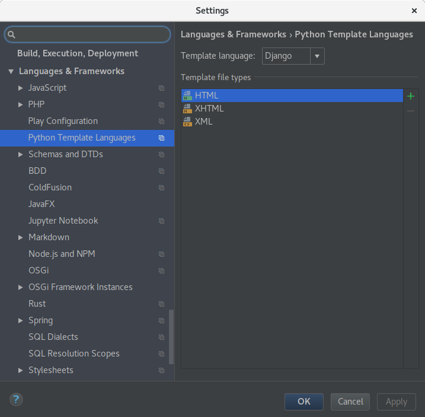

Store Development Installation
==============================
This setup details a local development installation in order to work and test App Store changes. The App Store is build using `Django <https://www.djangoproject.com/>`_. The frontend is written in TypeScript and does not yet use a JavaScript framework; this decision might change however depending on how JavaScript intensive things might become.

.. note:: Only use this guide for your local development installation which is **not connected to the Internet** since your installation will be be initialized with insecure defaults!

Installing Packages
-------------------

First you want to switch your machine to an up to date Node.js version and install Yarn::

    curl -sS https://deb.nodesource.com/gpgkey/nodesource.gpg.key | sudo apt-key add -
    echo "deb https://deb.nodesource.com/node_8.x xenial main" | sudo tee /etc/apt/sources.list.d/nodesource.list
    echo "deb-src https://deb.nodesource.com/node_8.x xenial main" | sudo tee -a /etc/apt/sources.list.d/nodesource.list

    curl -sS https://dl.yarnpkg.com/debian/pubkey.gpg | sudo apt-key add -
    echo "deb https://dl.yarnpkg.com/debian/ stable main" | sudo tee /etc/apt/sources.list.d/yarn.list

Then install the following libraries::

    sudo apt-get update
    sudo apt-get install python3-venv python3-wheel libxslt-dev libxml2-dev libz-dev libpq-dev build-essential python3-dev python3-setuptools git gettext libssl-dev libffi-dev nodejs yarn

Finally `download the latest geckodriver <https://github.com/mozilla/geckodriver/releases>`_ and install it (adjust URLs/package names if needed)::

    wget https://github.com/mozilla/geckodriver/releases/download/v0.21.0/geckodriver-v0.21.0-linux64.tar.gz
    sudo sh -c 'tar -x geckodriver -zf geckodriver-v0.21.0-linux64.tar.gz -O > /usr/bin/geckodriver'
    sudo chmod +x /usr/bin/geckodriver
    rm geckodriver-v0.21.0-linux64.tar.gz

Download the Source
-------------------
Clone the repository using git and change into it::

    git clone https://github.com/nextcloud/appstore.git
    cd appstore

Install poetry
--------------
Install poetry to handle python dependencies::

    pip install poetry==1.4.2

App Store Setup
---------------
The project root contains a **Makefile** which allows you to quickly set everything up by running::

    make dev-setup

This will automatically set up the web app using **venv**, **SQLite** as database and create a default **development** settings file in **nextcloudappstore/settings/development.py**. You need to review the development settings and change them according to your setup. An admin user with name **admin** and password **admin** will also be created.

Launching the Development Server
--------------------------------
The server can be started after activating the virtual environment first::

    poetry shell
    export DJANGO_SETTINGS_MODULE=nextcloudappstore.settings.development
    python manage.py runserver

The website is available at `http://127.0.0.1:8000 <http://127.0.0.1:8000>`_. Code changes will auto reload the server so happy developing! For more documentation on development, check out :doc:`storedeveloper`

Every time you start a new terminal session you will need to reactive the virtual environment and set the development settings::

    poetry shell
    export DJANGO_SETTINGS_MODULE=nextcloudappstore.settings.development

We therefore recommend creating a small bash alias in your **~/.bashrc**::

    alias cda='cd path/to/appstore && poetry shell && export DJANGO_SETTINGS_MODULE=nextcloudappstore.settings.development'

Keeping Up to Date
------------------

.. note:: Before updating it is recommended to stop the development server.

To check out the latest changes simply pull::

    git pull --rebase origin master

then make sure that the virtual environment is enabled and install new libraries::

    make update-dev-deps

apply new database migrations::

    python manage.py migrate

and build the latest frontend::

    yarn run build

IntelliJ IDEA Ultimate/PyCharm Setup
------------------------------------

You can use any editor/IDE that you want to. However if you are already using `IntelliJ IDEA Ultimate <http://www.jetbrains.com/idea/buy>`_ with the Python plugin or `PyCharm <http://www.jetbrains.com/pycharm/buy>`_ you can import a fully installed project with the following steps:

.. note:: The configuration uses the **Django** Facet which is only included in the commercial IDE releases.

In the project window click **Open** and select the cloned **appstore** folder:

Afterwards you are presented with the main window. From here, click on the project settings icon:

.. image:: _static/img/idea3.png
  :alt: main window

Then you need to add a new SDK. To do that click on **New...** -> **Python SDK** -> **Add Local** and select the Python executable **venv/bin/python** in your local **venv** folder:

In your project settings go to **SDKs** and select your recently added Python SDK. Rename it to **Python** and close the project window by clicking **OK**.

You are now ready to start developing. You can start the server by choosing the run configuration **Server** and run all tests by selecting the run configuration **Tests**.

.. note:: Should you have issues with unrecognized imports just invalidate your caches by going to your global menu and clicking **File** -> **Invalidate Caches / Restart** -> **Invalidate and Restart**

IntelliJ IDEA Ultimate Specific Setup
~~~~~~~~~~~~~~~~~~~~~~~~~~~~~~~~~~~~~

To enable support for Django templates, open your IDE settings by clicking **File** -> **Settings**. Then go to **Languages and Frameworks** -> **Python Template Languages** and select **Django** in the drop down menu on the right. Confirm your changes by clicking **OK**

